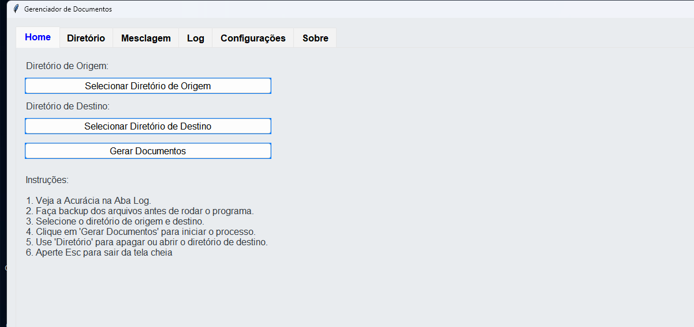
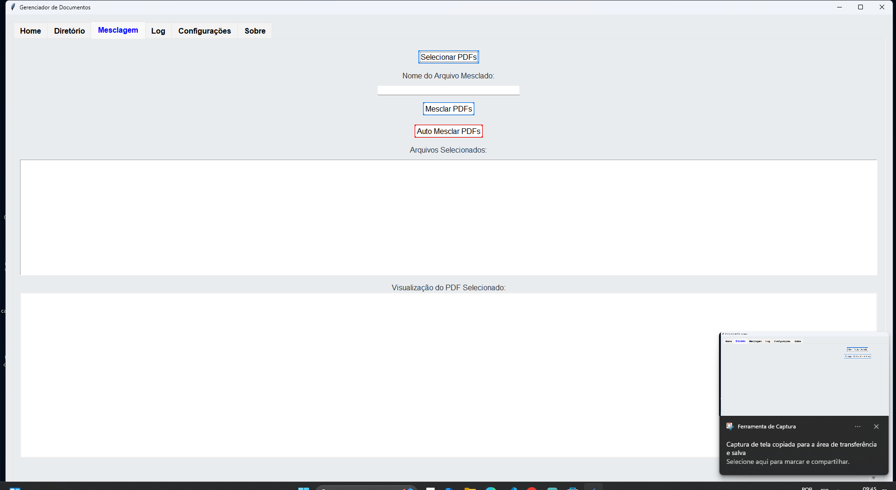
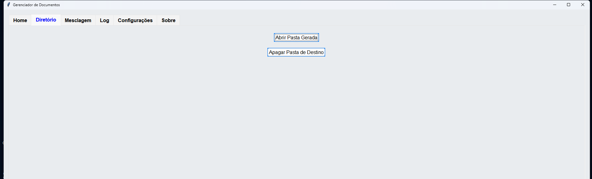
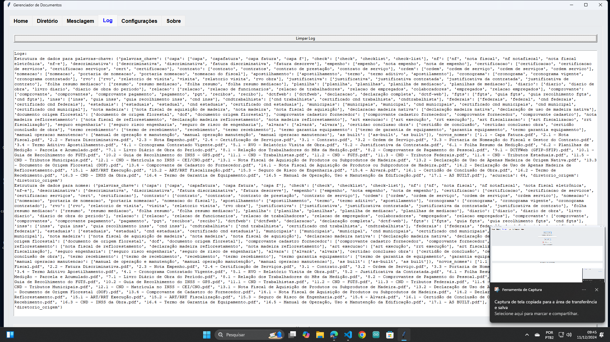
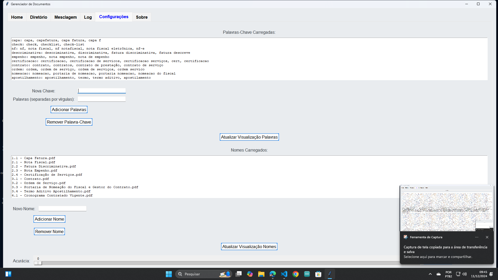
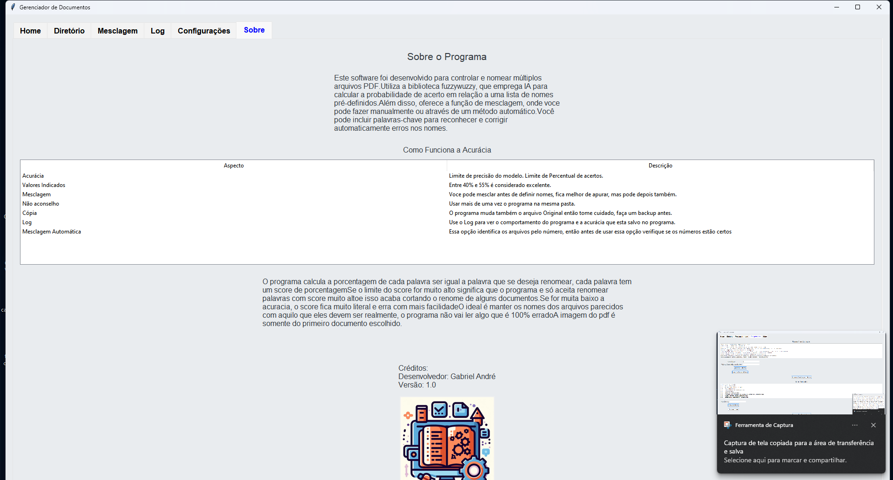

# Projeto: Documento Relacionais


Programa offline para manipulação de arquivos PDF, com funcionalidades de:

1. ✂️ **Mesclagem de documentos**: Combina múltiplos arquivos PDF em um único documento.
2. 📝 **Renomeação inteligente**: Aplica padrões de nomeação consistentes com base em versionamentos e palavras-chave.

### 🎯 Propósito

Voltado para profissionais da área de **Engenharia de Processos**, este programa facilita a organização de documentos relacionados a processos de contratação, licitações e despachos. Ele resolve o problema de arquivos recebidos de fontes variadas com nomes inconsistentes, tornando o gerenciamento de arquivos mais ágil e padronizado.

### 📂 Exemplo de Uso

Imagine que você possui:

- **15 documentos PDF** de processos, cada um com nomes despadronizados e recebidos de diferentes fontes.
- Alguns desses documentos precisam ser mesclados para compor conjuntos completos.

**Ação**:

1. Execute o programa.
2. Escolha a pasta onde os documentos estão localizados.
3. Com base em uma lista de palavras-chave e padrões configurados, o programa:
   - 🔍 Identifica os arquivos relevantes.
   - 🖋️ Renomeia-os automaticamente com base nos padrões definidos.
   - 📎 Mescla os documentos necessários em conjuntos coesos.

### ⚙️ Como Funciona

1. **Seleção de Arquivos**: O programa permite escolher uma pasta e utiliza palavras-chave para identificar arquivos específicos.
2. **Renomeação Automática**: Com um modelo de IA, analisa os nomes existentes e ajusta conforme o padrão predefinido.
3. **Mesclagem**: Combina os documentos selecionados em um arquivo único, quando necessário.

### 📸 Prints do Programa

Abaixo estão capturas de tela que demonstram o funcionamento do programa:









### 🌟 Benefícios

- **Eficiência**: Reduz o tempo gasto na organização de documentos.
- **Padronização**: Garante consistência nos nomes dos arquivos.
- **Praticidade**: Funciona offline, sem depender de conexão com a internet.

### 🛠️ Requisitos

- Sistema Operacional: Windows, macOS ou Linux
- Dependências:
  - Python 3.x
  - Bibliotecas: PyPDF2, pandas, entre outras (listadas no arquivo `requirements.txt`).

### 🚀 Instalação

1. Clone o repositório:
   ```bash
   git clone https://github.com/GabrielAndre2811/Projeto-Documento-Relacionais.git
   ```
2. Instale as dependências:
   ```bash
   pip install -r requirements.txt
   ```
3. Execute o programa:
   ```bash
   python main.py
   ```

### 🤝 Contribuições

Contribuições são bem-vindas! Abra um *pull request* com melhorias, ou relate problemas na aba de *issues*.

---

**Nota:** As capturas de tela usadas no README estão na pasta `./screenshots`. Certifique-se de mantê-las atualizadas ao adicionar novas funcionalidades.
